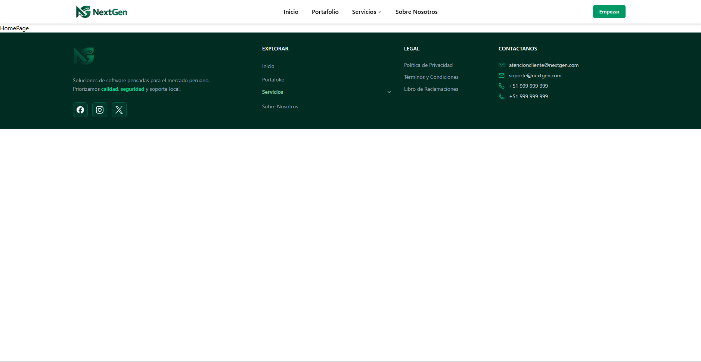

# Modern SaaS Landing Page Template

Una plantilla de Landing Page moderna, responsive y altamente personalizable diseñada para productos SaaS.

## Tech Stack

- **Core:** [React 19](https://react.dev/) + [Vite](https://vitejs.dev/)
- **Estilos:** [Tailwind CSS](https://tailwindcss.com/)
- **Componentes UI:** [Shadcn UI](https://ui.shadcn.com/) (Radix UI)
- **Iconos:** [Lucide React](https://lucide.dev/)
- **Enrutamiento:** [React Router](https://reactrouter.com/)

## Características Principales

### Custom Header
- **Responsive:** Se adapta fluidamente de móvil a escritorio.
- **Mobile-First:** Menú lateral (Sheet) optimizado para dispositivos táctiles.
- **Dropdowns Limpios:** Menús desplegables minimalistas en escritorio sin sobrecarga visual.
- **Glassmorphism:** Efectos de desenfoque en la barra de navegación.

### Custom Footer
- **Lógica de Acordeón:** En móviles, las secciones se colapsan para ahorrar espacio, utilizando `useState` para gestionar la apertura/cierre.
- **Animaciones Suaves:** Transiciones fluidas en altura y opacidad.
- **Grid Asimétrico:** Uso avanzado de CSS Grid para una distribución editorial del contenido.

### Diseño & UX
- **Tema Emerald:** Paleta de colores consistente y moderna.
- **Micro-interacciones:** Estados hover, focus y transiciones sutiles que mejoran la experiencia de usuario.
- **Modularidad:** Código refactorizado y separado en componentes lógicos.

## Instalación y Uso

1. **Clonar el repositorio**
2. **Ejecutar pnpm install / npm install**